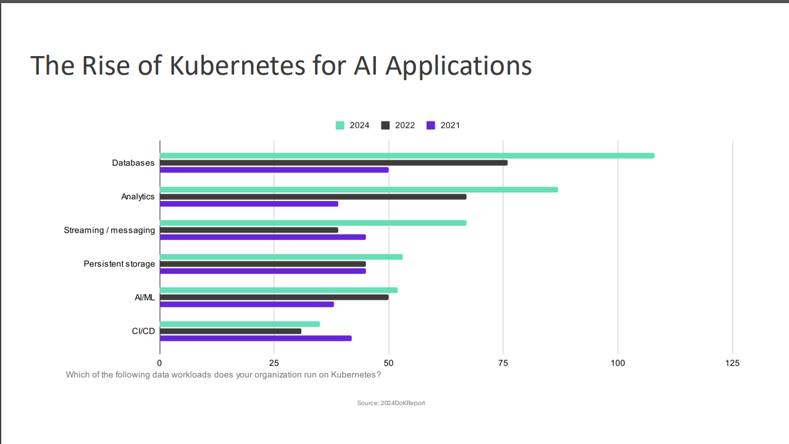
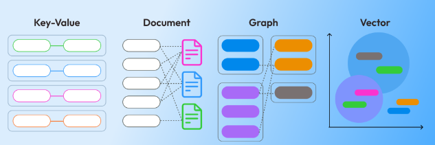
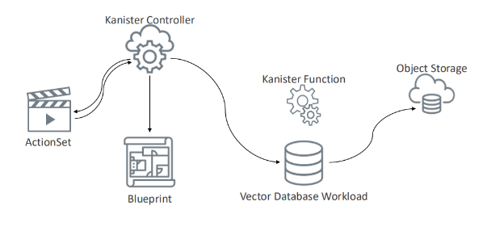

# Building Resilience in AI Applications: Protecting Vector Databases in Kubernetes

As AI continues to grow, more businesses are using AI technologies to improve their operations and drive innovation. AI helps improve workflows by automating routine tasks and faster feature delivery by streamlining development processes, providing insights through data analysis, and optimizing service delivery. As organizations increasingly adopt AI, development teams are placing more focus on the core data infrastructure—vector databases. These are key for storing and accessing the complex data that AI models use, such as for search, recommendations, and processing data in real-time. Any compromise, including unauthorized access or data breaches, can lead to inaccurate results and degraded application performance. Hence, resilient data protection strategies are crucial to ensuring the reliability and effectiveness of AI applications.

In a [recent talk](https://kccncna2024.sched.com/event/1i7m3/building-resilience-effective-backup-and-disaster-recovery-for-vector-databases-on-kubernetes-pavan-navarathna-shwetha-subramanian-veeam) at Kubecon North America 24, Shwetha and Pavan from Veeam discussed how to build resilience in AI applications by ensuring effective backup and disaster recovery strategies specifically tailored for Kubernetes environments.

In this post, we’ll quickly recap the key points from their talk, focusing on how to safeguard vector databases and how tools like Kanister can help ensure data protection and seamless recovery for Kubernetes-based applications.

## The Rise of AI in Enterprise Applications

As businesses adopt AI to enhance operations, security and data integrity become essential considerations. AI applications are not just about automation or optimization - they are at the core of modern enterprise architectures, driving optimized resource management, intelligent automation, enhanced user experience, and predictive maintenance.

As organizations increasingly rely on AI for day-to-day operations, ensuring the integrity and availability of the data these systems depend on is vital. Failure to protect this data could lead to business disruption and loss of competitive advantage.

## Why Kubernetes is Ideal for AI Applications

Kubernetes has become the go-to platform for deploying AI applications. It is already the default choice for cloud-native apps and powers much of the internet by managing containerized workloads efficiently. Here's why Kubernetes is great for AI applications:

- **Scalability:** Kubernetes allows AI applications to scale automatically through the Horizontal Pod Autoscaler (HPA), which adjusts pod counts based on CPU or memory usage, and the Cluster Autoscaler (CA), which dynamically scales cluster nodes to meet resource demands effectively handling varying loads and ensuring optimal performance during peak demand.
- **High Performance:** It supports dynamic allocation of compute resources, including CPUs and GPUs, which is crucial for efficient AI model training and inference.
- **Multi-Cloud Deployment:** Kubernetes enables seamless deployment across multi-cloud environments, providing portability and efficient distribution of workloads.
- **Integrated Backup and Disaster Recovery:** Built-in solutions like Persistent Volumes (PVs) and Stateful Sets in Kubernetes maintain data integrity across pod restarts.
- **Self-Healing Capabilities:** Kubernetes automatically manages workloads by restarting failed pods or redistributing them to healthy nodes, ensuring high availability.

With its capabilities in high availability, cloud agnosticism, and resource management, Kubernetes supports the reliability and performance required for mission-critical AI workloads. Recent trends also indicate that more organizations are deploying their databases on Kubernetes for its flexibility, especially in supporting disaster recovery.

*Source: 2024 CoM Report*

## Vector Databases and RAG Systems

Vector databases are specialized systems designed to store and organize data as vectors—lists of numbers that represent the meaning of inputs like text, images, audio, or videos. These vectors are generated by AI models that convert raw data into numerical representations, known as embeddings capturing their meaning in multi-dimensional space. Without a well-organized vector database, AI systems risk generating inaccurate or "hallucinated" responses due to missing or corrupted data.

*Source: Brilworks*

### Vector Databases vs Traditional Databases

RAG (Retrieval Augmented Generation) systems retrieve relevant information from vector databases before generating responses, using the provided knowledge along with general knowledge crafting better, more contextual replies. This ensures that AI outputs are grounded in accurate and contextually rich data. Vector embeddings are crucial for this to match and retrieve relevant data quickly and efficiently.

However, deploying these databases on Kubernetes introduces unique challenges. Any disruption to these vector databases could lead to loss of context and misinformed decisions, impacting the user experience.

## Necessity of Data Protection for Vector Databases

Protecting vector databases is crucial because they store embeddings for machine learning models, LLMs, and RAG systems. Loss or corruption of this data can result in inaccurate outputs, degraded application performance, and operational disruptions.

The talk outlined several specific challenges and necessities tied to safeguarding vector databases on Kubernetes:

- **Data Integrity and Security:** Vector DBs hold high-dimensional embeddings critical for AI accuracy. Protecting this data ensures it remains uncompromised and secure against breaches or corruption.
- **Disaster Recovery:** Quick data restoration is vital in the event of a failure or data loss. Downtime can lead to financial losses and compromise the accuracy of applications relying on embeddings, making effective disaster recovery strategies essential.
- **Cost Efficiency:** Effective backups eliminate the need for retraining AI models, saving computational resources, time, and financial costs associated with data loss.
- **Version Control and Compliance:** Backups ensure adherence to regulatory standards by maintaining data integrity and enabling rollback to previous states. They also support long-term application health by tracking changes, ensuring data consistency, and facilitating compliance with industry regulations.

Failing to protect the data and databases powering AI applications can result in unpredictable or inaccurate responses, compromising the model's effectiveness and users' trust.

## Approaches to Data Protection in Kubernetes

Effective data protection is not one-size-fits-all; various approaches offer unique advantages for safeguarding data. The talk highlighted several "flavors" of data protection organizations can implement for their AI applications.

- **Storage Snapshots:** This approach utilizes the underlying storage system's ability to capture point-in-time snapshots of data. It provides a fast and efficient way to create backups with minimal performance overhead.
- **Storage Snapshots with Data Service Hooks:** By integrating storage snapshots with data service hooks, snapshots capture a consistent state of both the database and its running services. For example, using a data service hook in a Kubernetes environment can ensure that it captures all relevant application states when a snapshot is taken, such as pausing database transactions to maintain consistency during the backup process.
- **Data Service Snapshots:** These snapshots are taken at the application level, ensuring the data is consistent as defined by the application. It’s particularly useful for databases like Vector DBs, which require specific consistency guarantees. For instance, tools like pg_dump for PostgreSQL and mongodump for MongoDB allow users to create consistent backups of their databases.
- **Combination of Methods:** Often, businesses deploy a hybrid approach, combining the above strategies to ensure comprehensive coverage for both performance and reliability. For example, using storage snapshots for quick recovery and data service snapshots for consistency-critical operations ensures the application state is preserved accurately during backups.

## Introducing Kanister: Streamlining Data Protection for Kubernetes

To address these challenges, the talk introduced [Kanister](https://www.kanister.io/), an open-source tool designed to facilitate backup and recovery for Kubernetes-based applications. It offers a seamless data protection solution specifically for Kubernetes environments, enabling businesses to manage backups, restores, and data integrity efficiently.

### How Kanister Protects Vector Databases

*Source: PPT kubeconNA*
A typical flow in Kanister is as follows:

1. [ActionSet](https://docs.kanister.io/architecture.html#actionsets) initiates the backup or restore process.
2. Kanister Controller monitors and processes the ActionSet, referring to the [Blueprint](https://docs.kanister.io/architecture.html#blueprints) that contains the necessary instructions.
3. Kanister Functions interact with the Vector Database Workload, performing operations like creating data dumps, exporting or importing data, and ensuring that database states are accurately captured.
4. The data is stored in Object Storage, ensuring that a reliable backup is available for restoration when needed.
5. The status is updated back to the Kanister Controller, which then passes it to the user via the ActionSet.

Through its ActionSets, users can automate backup or restore operations, ensuring that the data protection process is simple, consistent, and reliable. Additionally, Kanister profiles help define backup targets, whether they be on-premises storage or cloud platforms like AWS, ensuring flexibility and scalability in backup strategies.

The talk included a demo of how Kanister can be configured to perform backups using AWS S3 and restore processes. This hands-on approach highlighted the tool’s ability to restore data quickly after accidental deletion, showing how it helps reduce downtime and ensure business continuity.

<iframe width="560" height="315" src="https://www.youtube.com/embed/kl32-01tXE4" frameborder="0" allow="accelerometer; autoplay; encrypted-media; gyroscope; picture-in-picture" allowfullscreen></iframe>

## Build Resilience in Your AI Workflows

In conclusion, vector databases are essential for managing the complex, high-dimensional data that powers AI applications. As businesses increasingly rely on these databases, safeguarding them becomes critical to prevent data loss and ensure operational continuity. Implementing robust backup strategies tailored to vector data is vital for maintaining the performance and reliability of AI-driven solutions.

Kanister offers an effective way to manage and protect vector databases on Kubernetes. Through its structured workflows, Kanister automates backup and recovery processes, helping organizations secure their data and enhance resilience against potential disruption.

By adopting comprehensive backup strategies, businesses can ensure their AI applications remain resilient in an ever-evolving digital landscape. [Explore Kanister](https://docs.kanister.io/overview.html) for your Kubernetes-based applications and take the first step toward securing your AI applications against data loss.
